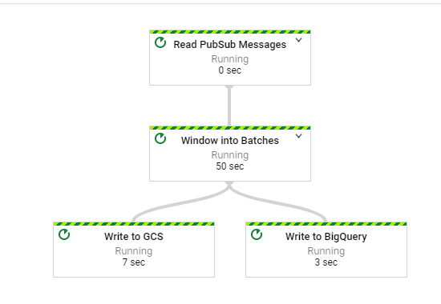

# streaming-data-processing-with-pubsub-dataflow-bigquery 
[Not Finished!]

## Introduction

[Google Cloud Platform Data Engineering training project: Streaming Data Processing](https://github.com/GoogleCloudPlatform/training-data-analyst/tree/master/courses/streaming) <br>
At the time Google designed the above training project, streaming pipelines are not available in the DataFlow **python** SDK. So the streaming labs are written in Java.

This project is to rewrite the above streaming pipelines in Python (Apache Beam Python):
1. Use Dataflow to collect traffic events from simulated traffic sensor data through Google PubSub
2. Process the simulated traffice sensor data
3. Write the data into BigQuery for further analysis

## Preparation
### Install the Python3 PIP program required to install the API
sudo apt-get install python3-pip

###	Use PIP3 to install the Google Cloud Pub/Sub API
sudo pip install -U google-cloud-pubsub

### Use PIP3 to install the Apache Beam
pip3 install apache-beam[gcp]

## Execution
```
python3 CurrentConditions.py 
--output_path "gs://my-first-gcp-project-271812/javahelp" 
--runner DataFlowRunner 
--project "my-first-gcp-project-271812" 
--region "us-central1" 
--temp_location "gs://my-first-gcp-project-271812/temp" 
--staging_location "gs://my-first-gcp-project-271812/staging"

```

## Dataflow Task Graph



